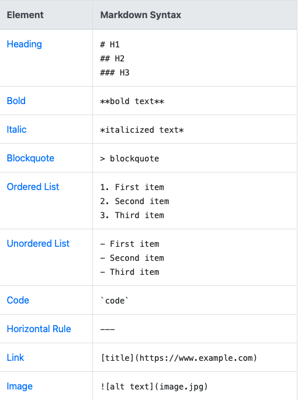
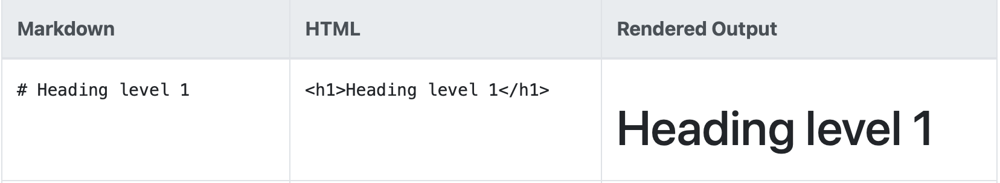

<!-- Title -->
# **A README.md File**  <- Title 

This README is to answer the question: What is a README.md file and how it's useful?

<!-- Introduction/Overview -->
## What is a README.md file ?  <- Introduction / Overview / Keywords

 A README is usually a text file made using the markup language Markdown, hence the extension  .md . You can use any text editor to create a README file, I used VScode :smile:

  The history of README files is not very clear but there is an assumption that it may have began with early Macintosh system software installed with a "Read Me" on the Startup Disk . . . says wiki :)

## Creating a README 
README.md files can be created through text editor, Github, or the command line.

 
    <pre>
    MD stands for Markdown which is a markup language just like HTML. 
    HTML tags can be mixed with Markdown syntax.
    </pre>

 
    <pre>
    README files are a general overview of the package 
    </pre>

<!--  -->

## Markdown and HTML Syntax   <- Visuals and Additional Subtopics (prerequisites, installations, Table of Contents) 

    <pre>
There's also Markdown syntax for emojis 
    </pre>

## WHO IS IT FOR ?
 
 Who is the reader? Collaborators, contributers, fellow programmers . . . anyone who is interested in using your project!

A step in documenting your project 
.md extension indicating that it's a Markdown file and allows you to format the text

## Additional Subtopics   <- README's can vary depending on the project. 
* CONTRIBUTERS // HOW TO CONTRIBUTE
* VERSIONS
* AUTHOR 
* LICENSE
* ACKNOWLEDGMENTS

`There are so many ways you can format your README! It is not a one size fits all! `

## Source
https://www.markdownguide.org

